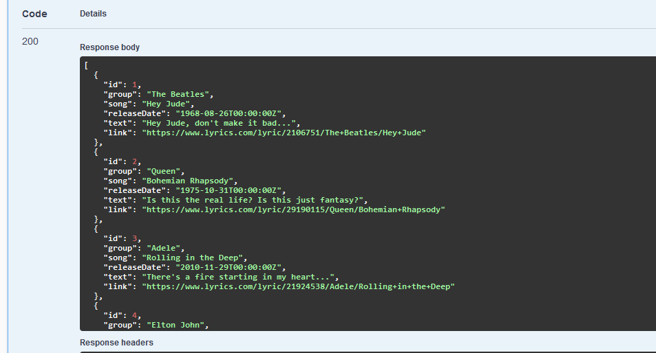

Онлайн библиотеки песен 🎶

Стек технологий:
```go```, ```gin```, ```sqlx```, ```logrus```, ```goose```, ```postgres```

Присутствует документация ```swagger```:

* Файл
  ```openapi.yaml``` или по ссылке

* ```http://localhost:8080/swagger/index.html```

Для подключения к базе данных и внешнего сервиса требуется .env файл в корне проекта

### .env

``` yaml
#Database parameters 
USER=           #postgres
DBNAME=         #song_lib_db
PASSWORD=       #not 123456
SSLMODE=        #enable / disable
HOST=           #127.0.0.1
PORT=           #5432

#For /info requests. used in clientService
EXTERNAL_API=   #host:port 
```

## Маршруты сервиса

### Swagger UI

```GET /swagger/index.html```

обращается к http://localhost:8080/openapi.yaml

### Ping

```GET /ping```

Возвращает структуру

```json
{
  "message": "pong!"
}
```

### 1 Получение данных библиотеки с фильтрацией по всем полям и пагинацией

```GET /songs```

Использует ```параметры запроса``` для фильтрации

Каждый параметр является необязательным.


```json
{
  "id": int
  "song": string
  "group": string
  "releaseDate": string
  "text": string
  "link": string
  "offset": int
  "limit": int
}
```
Если сделать запрос без параметров то

в таком случае выведутся первые 10 песен



Иначе возвращает только те песни, которые подходят под критерии

Пример запроса

```http://localhost:8080/songs/?song=sunflower&link=youtube.com```

### 2 Получение текста песни с пагинацией по куплетам

```GET /songs/:id```

В ```параметре запроса``` принимает ```offset: int```

GET ```/songs/3?offset=3```

Выводит по 3 куплета

### 3 Удаление песни

```DELETE songs/:id```

### 4 Изменение данных песни

```PUT songs/:id```

Меняет модель с айди из запроса на ту, которая приходит в теле

Возвращает id

### 5 Добавление новой песни в формате JSON

```POST /songs```

Принимает в теле два поля

```yaml
{
  song: string
  group: string
}
```

Обращается к
```GET http://EXTERNAL_API/info```

Получает структуру SongDetail и добавляет в бд новую песню